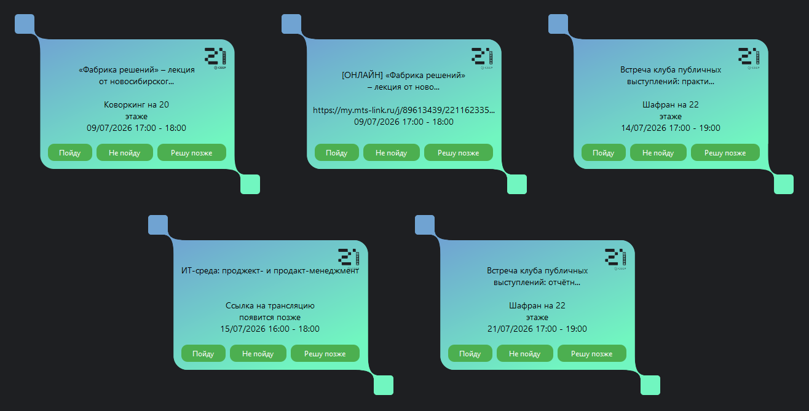
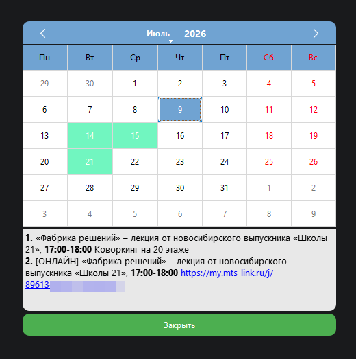
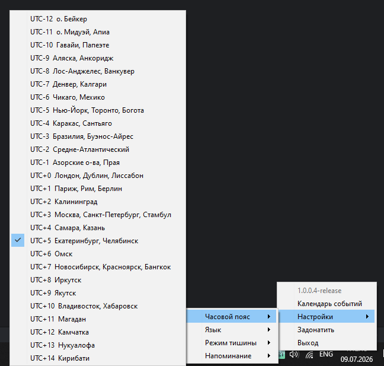

# S21 Notify (1004-release)

Десктопное приложение для пиров School 21 Sber (Школа 21 Сбер). Работает в системном трее, опрашивает API платформы и показывает уведомления о событиях.

## Возможности

- Авторизация
- Периодический опрос событий (каждые 15 минут)
- Звуковое оповещение о новых событиях
- Напоминание за (1, 5, 10, 15, 30) минут до начала события
- Настраиваемый режим тишины (время начала и окончания)
- Настраиваемый часовой пояс 
- Календарь событий с подсветкой дат и ссылками
- Локализованный интерфейс (русский / английский)

## Скриншоты

